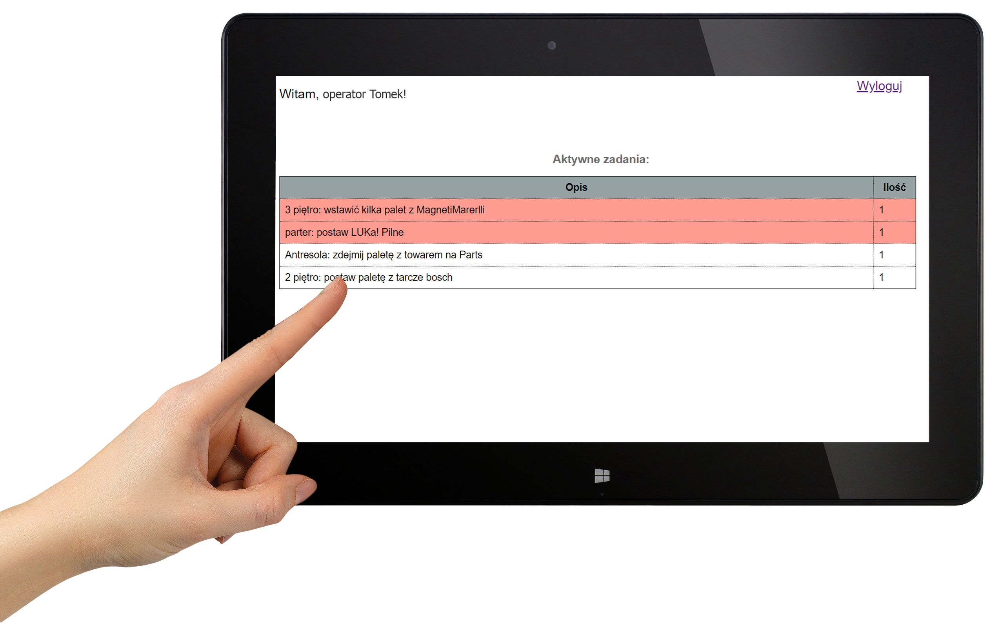

# app1
My first Java-web application using servlets and Hibernate
I created it for the needs of my current job.

I used such technologies:

Backend:
- Java Servlets
- Maven
- MySQL Database
- Hibernate

Frontend:
- Jquery
- Ajax

